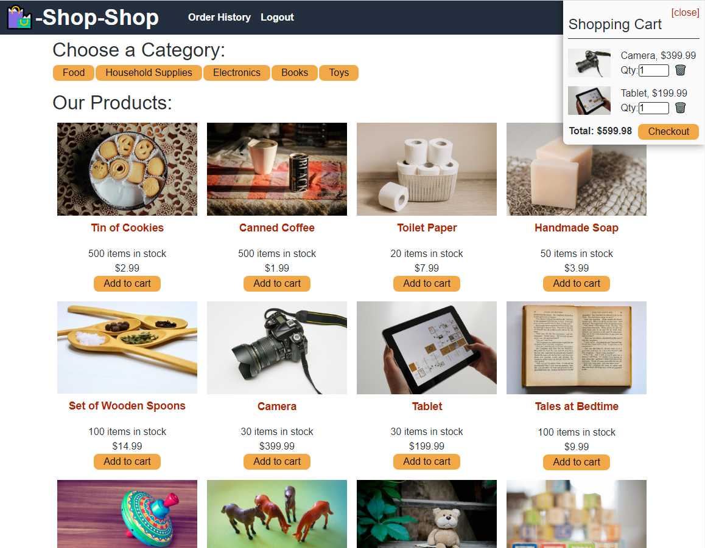

# Shop-Shop

## Description of the Website
This is an prototype for an e-commerce website called Shop-Shop. It allows the user to choose from a database of products, narrow down their product results by specific categories, add items to their shopping cart, and checkout using Stripe payment processing.

 

## Website Features
* Application is a single-page web application using React.
* Using indexedDB, the user has offline abilities to continue viewing the products and categories, add or remove products from cart, and come back later with all of the items added to their shopping cart still showing.
* Website uses Redux to allow for a global state across all components.
* Website uses Stripe for processing payments.

  
 

## Link to Website
https://uw-shop-shop.herokuapp.com/

 

## How the Website Looks

 

## Credits

*Project completed by Chris Wein - refactored starter code to replace Context API with Redux